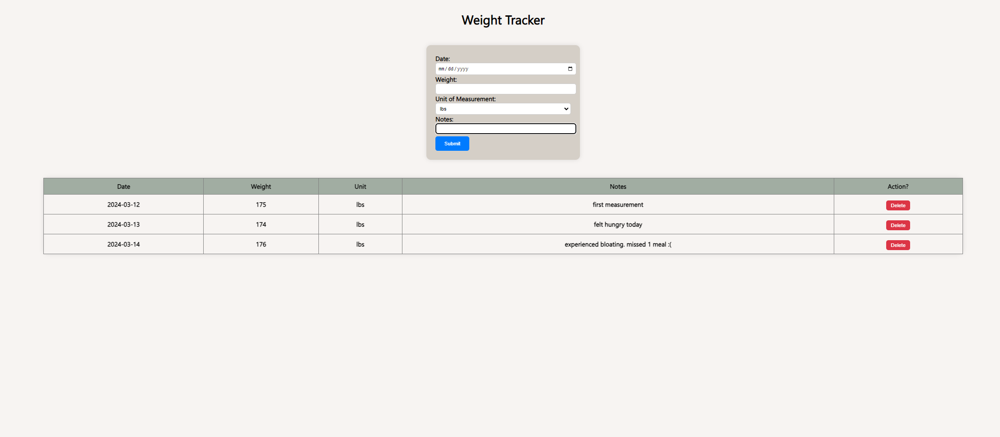

# Weight Tracker App

Weight Tracker app that was created with HTML/CSS and JavaScript

### Start tracking your progress [here](https://kimdaby.github.io/Todo-App/)

## Summary

The weight tracker app, crafted with HTML, CSS, and JavaScript, empowers users to monitor weight fluctuations effortlessly. It boasts a sleek interface accommodating date, weight, preferred units (lbs/kgs), and notes. Utilizing tables, it organizes data neatly for easy comprehension. Input forms streamline data entry and modification, ensuring a seamless user experience. JavaScript facilitates dynamic DOM manipulation, enabling real-time updates without page reloads. In essence, this app provides a succinct solution for users to track weight changes, enhancing their fitness journey with simplicity and efficiency.

## Author

David (Yun) Kim
